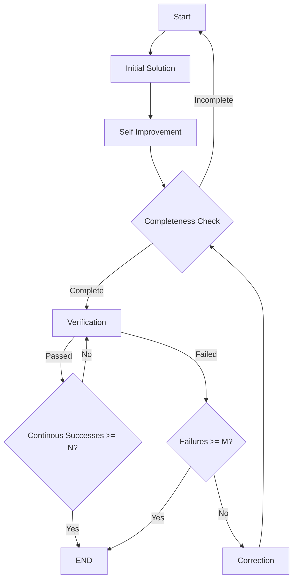

# IMO Problem-Solving Agent Framework

This project provides a framework for building and evaluating Large Language Model (LLM) agents designed to solve International Mathematical Olympiad (IMO) problems. It is an evolution of the work from [Google's IMO25 repository](https://github.com/lyang36/IMO25), refactored for greater flexibility and extensibility.

## Purpose

The primary goal of this framework is not just to find correct answers to IMO problems, but to provide a standardized environment for testing, comparing, and analyzing the reasoning capabilities of different LLMs on complex, multi-step mathematical problems.

## Key Improvements

This version introduces several significant enhancements over the original implementation:

-   **Multi-Model Support via LiteLLM**: Integrated `litellm` as a universal routing layer, allowing seamless switching between various models (e.g., GPT, Gemini, Claude, DeepSeek) without code changes.
-   **Declarative Workflow with LangGraph**: Re-architected the agent's reasoning process using `langgraph`. This provides a clear, visual, and modular workflow that is easy to understand, modify, and extend.
-   **Enhanced Code Structure**: The codebase has been refactored for better clarity, modularity, and maintainability.

## Tests & Results

We conducted a test on **IMO Problem 1** using `azure/gpt-4.1`. The complete log of this run can be found in `run_logs/gpt4.1_solution_01_agent_run_step_10.log`.

When compared with results from Gemini 2.5 Pro, we observed that Gemini produced the correct answer, while GPT-4.1's solution was incorrect.

## Getting Started

### Prerequisites

-   Python 3.8+
-   An LLM API key (e.g., for OpenAI, Anthropic, Google AI Studio)

### Installation

1.  **Clone the repository:**
    ```sh
    git clone <repository-url>
    cd <repository-folder>
    ```

2.  **Set up a virtual environment and install dependencies:**
    ```sh
    python -m venv venv
    source venv/bin/activate
    pip install -r requirements.txt
    ```

3.  **Configure your environment:**
    Copy the example environment file and add your API keys.
    ```sh
    cp .env.example .env
    # Edit .env with your credentials
    ```

### Running the Agent

To run the agent on a problem, use the `refactored_agent.py` script.

**Example Command:**

```sh
python code/refactored_agent.py problems/imo01.txt \
  --model azure/gpt-4.1 \
  --temperature 0.1 \
  --max-runs 10 \
  -l run_logs/my_solution_01_agent_10.log
```

## Agent Workflow

The agent's logic is orchestrated by the following LangGraph workflow. This graph defines the sequence of steps the agent takes to generate, refine, and verify a solution, including the conditions for terminating the process.

The process terminates when a solution is successfully verified `N` consecutive times, or when the cumulative number of failures reaches a limit of `M`.



## Future Work

This framework is a work in progress. Key areas for future exploration include:

-   **Prompt Engineering**: Can the reasoning gaps observed in models like GPT-4.1 be bridged with more sophisticated prompting strategies?
-   **Model Evaluation**: We encourage the community to contribute evaluations for other models, such as DeepSeek's latest releases.
-   **Advanced Tooling**: Integrating tools for symbolic math, code execution, or formal verification to augment the agent's capabilities.